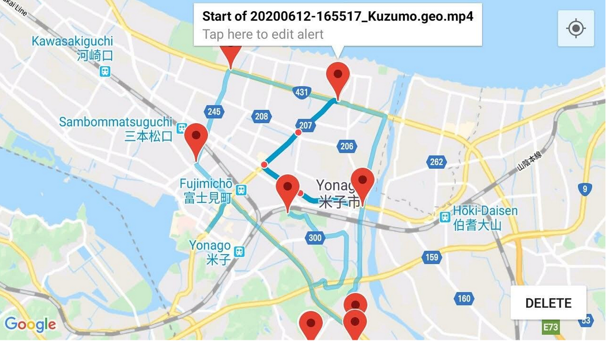
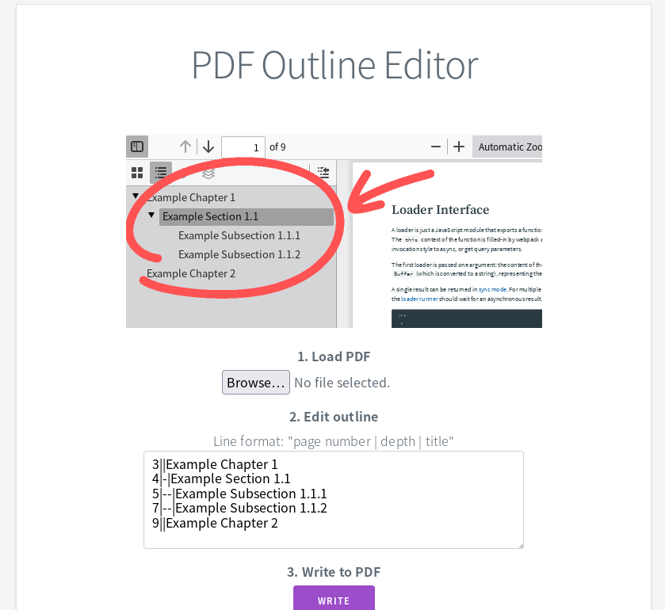

# ポートフォリオ

## summerview (Android, Kotlin)
https://github.com/fujifruity/summerview  
積雪前のドラレコ映像を提示して除雪車オペレーションを支援するアプリ。
* Fused Location Provider API で地理情報の取得
* Google Maps API で経路・マーカーを描画
* Kotlin Flow で位置情報のSequenceを非同期に逐次処理
* Repository, LiveData, ViewModel でデータの変更を一元管理
* CameraX でプレビュー・録画
* 検索に適したデータ構造の実装 (kd木)

  

## videoplayer (Android, Kotlin)
https://github.com/fujifruity/videoplayer  
MediaCodecのasync modeを利用した高速なビデオプレーヤーライブラリ。
* JUnit4 でのunit test
* androidx.test でのinstrumented test

## userscript (JavaScript)
https://github.com/fujifruity/userscripts   
GreaseMonkeyスクリプト (GreaseMonkey: javascriptをページに注入して見た目を加工したり操作を自動化するブラウザ拡張)。Google検索結果を片手で操作するための NoMouseGoogle、ジャンプ可能な目次を作成する TableOfContents など。

## PDF Outline Editor (TypeScript, React)
https://github.com/fujifruity/pdf-outline-editor/tree/master  
PDFのアウトライン (しおり) を編集できるwebアプリ。

  
